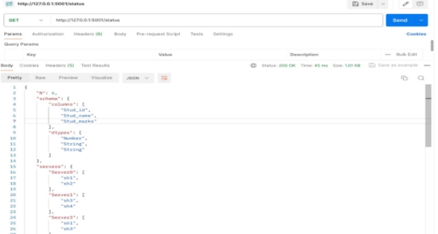
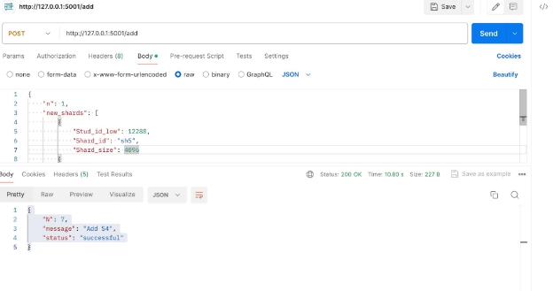
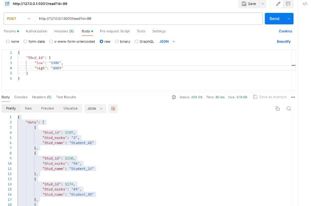
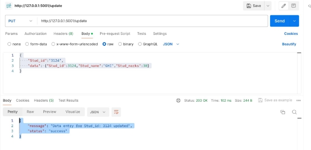
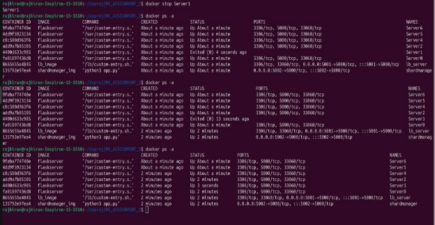

**# DS\_Project**

**To execute go to DS\_ASSIGNMENT\_1 folder :**

**->run "make build" (to build the image)**

**->once building the image you can send requests using tools like POSTMAN, ->cleanup the image by running "make clean"**

**->check readme.pdf for assignment 1 analysis ->check report\_ds.pdf for assignment 2 analysis.**

**Assignment - 3 check here or in readme_A3.pdf**

**TASK A-1**

No of Servers = 6 and shards = 4 , each shard has 3 replicas. For 10,000 Write requests:

Total time taken is 675.758668613337 seconds.

Speed is 14.798236947933228 requests per second.

For 10,000 Read requests:

Total time taken is 469.18102192878723 seconds. Speed is 21.31373506731014 requests per second.

Configuration used:

{

"N": 6,

"schema": {

"columns": [

"Stud\_id", "Stud\_name", "Stud\_marks"

],

"dtypes": [

"Number", "String", "String"

]

},

"shards": [

{

"Stud\_id\_low": 0, "Shard\_id": "sh1", "Shard\_size": 4096

}, {

"Stud\_id\_low": 4096, "Shard\_id": "sh2", "Shard\_size": 4096

}, {

"Stud\_id\_low": 8192, "Shard\_id": "sh3", "Shard\_size": 4096

}, {

"Stud\_id\_low": 12288, "Shard\_id": "sh4", "Shard\_size": 4096

}

],

"servers": { "Server0": [

"sh1", "sh2"

],

"Server1": [ "sh3", "sh4"

],

"Server3": [ "sh1", "sh3"

],

"Server4": [ "sh4", "sh2"

],

"Server5": [ "sh1", "sh4"

],

"Server6": [ "sh3", "sh2"

]

}

}

**TASK A-2**

For 10,000 write requests:

Total time taken is 1292.2386538176 seconds. Speed is 7.738455191190812 requests per second.

Write Speed down w.r.t Task 1 = 0.4771

For 10,000 read requests:

Total time taken is 446.0694181919098 seconds. Speed is 22.418035382326433 requests per second.

Read Speed up w.r.t Task 1 = 1.058 Configuration used:

{

"N": 8,

"schema": {

"columns": [

"Stud\_id", "Stud\_name", "Stud\_marks"

],

"dtypes": [

"Number", "String", "String"

]

},

"shards": [

{

"Stud\_id\_low": 0,

"Shard\_id": "sh1",

"Shard\_size": 2048 },

{

"Stud\_id\_low": 2048, "Shard\_id": "sh2", "Shard\_size": 2048

},

{

"Stud\_id\_low": 4096, "Shard\_id": "sh3", "Shard\_size": 2048

}, {

"Stud\_id\_low": 6144, "Shard\_id": "sh4", "Shard\_size": 2048

}, {

"Stud\_id\_low": 8192, "Shard\_id": "sh5", "Shard\_size": 2048

}, {

"Stud\_id\_low": 10240, "Shard\_id": "sh6", "Shard\_size": 2048

}, {

"Stud\_id\_low": 12288, "Shard\_id": "sh7", "Shard\_size": 2048

}, {

"Stud\_id\_low": 14336, "Shard\_id": "sh8", "Shard\_size": 2048

}

],

"servers": { "Server1": [

"sh2", "sh3", "sh4", "sh5", "sh6",

"sh7", "sh8"

"Server2": [

"sh1",

"sh3",

"sh4",

"sh5",

"sh6",

"sh7",

"sh8" ], "Server3": [

"sh1",

"sh2",

"sh4",

"sh5",

"sh6",

"sh7",

"sh8" ], "Server4": [

"sh1",

"sh2",

"sh3",

"sh5",

"sh6",

"sh7",

"sh8" ], "Server5": [

"sh1",

"sh2",

"sh4",

"sh3",

"sh6",

"sh7",

"sh8" ], "Server6": [

"sh1",

"sh2",

"sh4",

"sh5", "sh3",

"sh7",

"sh8" ], "Server7":[

"sh1",

"sh2",

"sh4",

"sh5",

"sh6",

"sh3",

"sh8" ], "Server8":[

"sh1",

"sh2",

"sh4",

"sh5",

"sh6",

"sh7",

"sh3" ]

}

}

**TASK A-3**

For 10,000 write requests:

Total time taken is 1264.0156018733978 seconds. Speed is 7.911294753940535 requests per second.

Write speed up = 1.046

For 10,000 read requests

Total time taken is 392.66022419929504 seconds. Speed is 25.46731088027 requests per second.

Read speed up = 1.19 Configuration used

{

"N": 10, "schema": {

"columns": [ "Stud\_id",

"Stud\_name", "Stud\_marks"

],

"dtypes": [

"Number", "String", "String"

]

},

"shards": [

{

"Stud\_id\_low": 0,

"Shard\_id": "sh1",

"Shard\_size": 2048 },

{

"Stud\_id\_low": 2048, "Shard\_id": "sh2", "Shard\_size": 2048

}, {

"Stud\_id\_low": 4096, "Shard\_id": "sh3", "Shard\_size": 2048

}, {

"Stud\_id\_low": 6144, "Shard\_id": "sh4", "Shard\_size": 2048

}, {

"Stud\_id\_low": 8192, "Shard\_id": "sh5", "Shard\_size": 2048

}, {

"Stud\_id\_low": 10240, "Shard\_id": "sh6", "Shard\_size": 2048

}

], "servers": {

"Server1": [

"sh1",

"sh2",

"sh3",

"sh5",

"sh6" ], "Server2": [

"sh4",

"sh2",

"sh3",

"sh5",

"sh6" ], "Server3": [

"sh4",

"sh2",

"sh5",

"sh6" ], "Server4": [

"sh1",

"sh2",

"sh3",

"sh4",

"sh6" ], "Server5": [

"sh1",

"sh2",

"sh4",

"sh5" ], "Server6": [

"sh1",

"sh4",

"sh3",

"sh5",

"sh6" ], "Server7": [

"sh1",

"sh2", "sh3", "sh5", "sh4"

], "Server8": [

"sh1", "sh2", "sh3", "sh5", "sh6"

], "Server9": [

"sh1", "sh2", "sh3", "sh4", "sh6"

], "Server10": [

"sh1", "sh3", "sh5", "sh4", "sh6"

]

}

}

**TASK A-4**

**Endpoints:**

**/init:**

**POST [http://127.0.0.1:5001/init** ](http://127.0.0.1:5001/init)**Payload: {

"N": 6,

"schema": { "columns": [ "Stud\_id",

"Stud\_name",

"Stud\_marks"

],

"dtypes": [

"Number", "String", "String"

]

},

"shards": [

{

"Stud\_id\_low": 0,

"Shard\_id": "sh1",

"Shard\_size": 4096 },

{

"Stud\_id\_low": 4096, "Shard\_id": "sh2", "Shard\_size": 4096

}, {

"Stud\_id\_low": 8192, "Shard\_id": "sh3", "Shard\_size": 4096

}, {

"Stud\_id\_low": 12288, "Shard\_id": "sh4", "Shard\_size": 4096

}

],

"servers": { "Server0": [

"sh1", "sh2"

],

"Server1": [ "sh3", "sh4"

],

"Server3": [ "sh1", "sh3"

],

"Server4": [

"sh4",

"sh2"

],

"Server5": [

"sh1",

"sh4"

],

"Server6": [

"sh3",

"sh2"

]

}

}

Response

{

"message": "Configured Database"

}

**/status:**

**GET [http://127.0.0.1:5001/status**](http://127.0.0.1:5001/status)**

Response:

{

"N": 6,

"schema": { "columns": [ "Stud\_id",

"Stud\_name", "Stud\_marks"

],

"dtypes": [

"Number", "String", "String"

]

},

"servers": { "Server0": [

"sh1", "sh2"

],

"Server1": [

"sh3", "sh4"

],

"Server2": [

"sh1", "sh3"

],

"Server4": [

"sh4", "sh2"

],

"Server5": [

"sh1", "sh4"

],

"Server6": [

"sh3", "sh2"

]

},

"shards": [

{

"Primary\_server": "Server2", "Shard\_id": "sh1", "Shard\_size": 4096, "Stud\_id\_low": 0

}, {

"Primary\_server": "Server0", "Shard\_id": "sh2", "Shard\_size": 4096, "Stud\_id\_low": 4096

}, {

"Primary\_server": "Server1", "Shard\_id": "sh3", "Shard\_size": 4096, "Stud\_id\_low": 8192

}, {

"Primary\_server": "Server4", "Shard\_id": "sh4", "Shard\_size": 4096, "Stud\_id\_low": 12288

}

]

}

**/add**

**POST** <http://127.0.0.1:5001/add>

Payload: {

"n": 1, "new\_shards": [

{

"Stud\_id\_low": 12288, "Shard\_id": "sh5", "Shard\_size": 4096

}

],

"servers": { "S4": [

"sh3", "sh5"

]

}

}

Response: {

"N": 7,

"message": "Add S4",

"status": "successful"

}

After doing /status {

"N": 7,

"schema": { "columns": [ "Stud\_id",

"Stud\_name", "Stud\_marks"

],

"dtypes": [

"Number", "String", "String"

]

},

"servers": {

"S4": [

"sh3", "sh5"

],

"Server0": [

"sh1", "sh2"

],

"Server1": [

"sh3", "sh4"

],

"Server2": [

"sh1", "sh3"

],

"Server4": [

"sh4", "sh2"

],

"Server5": [

"sh1", "sh4"

], "Server6": [

"sh3", "sh2"

]

},

"shards": [

{

"Primary\_server": "Server2", "Shard\_id": "sh1", "Shard\_size": 4096, "Stud\_id\_low": 0

}, {

"Primary\_server": "Server0", "Shard\_id": "sh2", "Shard\_size": 4096, "Stud\_id\_low": 4096

}, {

"Primary\_server": "Server1", "Shard\_id": "sh3", "Shard\_size": 4096, "Stud\_id\_low": 8192

}, {

"Primary\_server": "Server4", "Shard\_id": "sh4", "Shard\_size": 4096, "Stud\_id\_low": 12288

}

]

}

**/rm**

**DELETE** http://127.0.0.1:5001/rm **Payload:**

**{**

**"n" : 2,**

**"servers" : ["Server4"] }**

**Response:**

**{**

**"message": {**

**"N": 5, "servers": [**

**"Server4",**

**"Server0" ]**

**}**

**}**

After doing status: {

"N": 5,

"schema": { "columns": [ "Stud\_id",

"Stud\_name", "Stud\_marks"

],

"dtypes": [

"Number", "String", "String"

]

},

"servers": {

"S4": [

"sh4", "sh5"

],

"Server1": [

"sh3", "sh4"

],

"Server2": [

"sh1", "sh3"

],

"Server5": [

"sh1", "sh4"

],

"Server6": [

"sh3", "sh2"

]

},

"shards": [

{

"Primary\_server": "Server2", "Shard\_id": "sh1", "Shard\_size": 4096, "Stud\_id\_low": 0

}, {

"Primary\_server": "Server6", "Shard\_id": "sh2", "Shard\_size": 4096, "Stud\_id\_low": 4096

}, {

"Primary\_server": "Server1", "Shard\_id": "sh3", "Shard\_size": 4096, "Stud\_id\_low": 8192

}, {

"Primary\_server": "S4", "Shard\_id": "sh4", "Shard\_size": 4096, "Stud\_id\_low": 12288

}

]

}

**/write**

**POST [http://127.0.0.1:5001/write ](http://127.0.0.1:5001/write)Payload:**

**{**

**"data": [**

**{**

**"Stud\_id": 3124, "Stud\_name": "Student\_0", "Stud\_marks": 8**

**}, {**

**"Stud\_id": 2568, "Stud\_name": "Student\_1", "Stud\_marks": 96**

**}, {**

**"Stud\_id": 3455, "Stud\_name": "Student\_2", "Stud\_marks": 86**

**}, {**

**"Stud\_id": 4107, "Stud\_name": "Student\_3", "Stud\_marks": 30**

**}, {**

**"Stud\_id": 3887, "Stud\_name": "Student\_4", "Stud\_marks": 80**

**}, {**

**"Stud\_id": 4402, "Stud\_name": "Student\_5", "Stud\_marks": 100**

**}, {**

**"Stud\_id": 4304, "Stud\_name": "Student\_6", "Stud\_marks": 32**

**}, {**

**"Stud\_id": 2825, "Stud\_name": "Student\_7", "Stud\_marks": 40**

**}, {**

**"Stud\_id": 1489,**

**"Stud\_name": "Student\_8", "Stud\_marks": 16**

**}, {**

**"Stud\_id": 3495, "Stud\_name": "Student\_9", "Stud\_marks": 34**

**}, {**

**"Stud\_id": 2899, "Stud\_name": "Student\_10", "Stud\_marks": 39**

**}, {**

**"Stud\_id": 4004, "Stud\_name": "Student\_11", "Stud\_marks": 98**

**}, {**

**"Stud\_id": 3949, "Stud\_name": "Student\_12", "Stud\_marks": 90**

**}, {**

**"Stud\_id": 4732, "Stud\_name": "Student\_13", "Stud\_marks": 45**

**}, {**

**"Stud\_id": 1150, "Stud\_name": "Student\_14", "Stud\_marks": 96**

**}, {**

**"Stud\_id": 4577, "Stud\_name": "Student\_15", "Stud\_marks": 34**

**}, {**

**"Stud\_id": 2071, "Stud\_name": "Student\_16", "Stud\_marks": 65**

**}, {**

**"Stud\_id": 3894, "Stud\_name": "Student\_17", "Stud\_marks": 37**

**}, {**

**"Stud\_id": 4274, "Stud\_name": "Student\_18", "Stud\_marks": 86**

**}, {**

**"Stud\_id": 2021, "Stud\_name": "Student\_19", "Stud\_marks": 37**

**}, {**

**"Stud\_id": 8029, "Stud\_name": "Student\_20", "Stud\_marks": 39**

**}, {**

**"Stud\_id": 9752, "Stud\_name": "Student\_21", "Stud\_marks": 19**

**}, {**

**"Stud\_id": 9546, "Stud\_name": "Student\_22", "Stud\_marks": 95**

**}, {**

**"Stud\_id": 11225, "Stud\_name": "Student\_23", "Stud\_marks": 41**

**}, {**

**"Stud\_id": 10543, "Stud\_name": "Student\_24", "Stud\_marks": 54**

**}, {**

**"Stud\_id": 9504, "Stud\_name": "Student\_25", "Stud\_marks": 97**

**}, {**

**"Stud\_id": 11292, "Stud\_name": "Student\_26", "Stud\_marks": 81**

**}, {**

**"Stud\_id": 10748, "Stud\_name": "Student\_27", "Stud\_marks": 62**

**}, {**

**"Stud\_id": 9635, "Stud\_name": "Student\_28", "Stud\_marks": 56**

**}, {**

**"Stud\_id": 8507, "Stud\_name": "Student\_29", "Stud\_marks": 79**

**}, {**

**"Stud\_id": 10351, "Stud\_name": "Student\_30", "Stud\_marks": 97**

**}, {**

**"Stud\_id": 8471, "Stud\_name": "Student\_31",**

**"Stud\_marks": 89**

**}, {**

**"Stud\_id": 9892, "Stud\_name": "Student\_32", "Stud\_marks": 5**

**}, {**

**"Stud\_id": 11538, "Stud\_name": "Student\_33",**

**"Stud\_marks": 35**

**}, {**

**"Stud\_id": 9649, "Stud\_name": "Student\_34", "Stud\_marks": 78**

**}, {**

**"Stud\_id": 11138, "Stud\_name": "Student\_35", "Stud\_marks": 8**

**}, {**

**"Stud\_id": 9341, "Stud\_name": "Student\_36",**

**"Stud\_marks": 73**

**}, {**

**"Stud\_id": 9708, "Stud\_name": "Student\_37", "Stud\_marks": 79**

**}, {**

**"Stud\_id": 9629, "Stud\_name": "Student\_38", "Stud\_marks": 69**

**}, {**

**"Stud\_id": 11613, "Stud\_name": "Student\_39", "Stud\_marks": 49**

**}, {**

**"Stud\_id": 333, "Stud\_name": "Student\_40", "Stud\_marks": 26**

**}, {**

**"Stud\_id": 1107, "Stud\_name": "Student\_41", "Stud\_marks": 3**

**},**

**{**

**"Stud\_id": 2060, "Stud\_name": "Student\_42", "Stud\_marks": 1**

**}, {**

**"Stud\_id": 2846, "Stud\_name": "Student\_43", "Stud\_marks": 2**

**}, {**

**"Stud\_id": 5560, "Stud\_name": "Student\_44", "Stud\_marks": 72**

**}, {**

**"Stud\_id": 1174, "Stud\_name": "Student\_45", "Stud\_marks": 49**

**}, {**

**"Stud\_id": 1534, "Stud\_name": "Student\_46", "Stud\_marks": 31**

**}, {**

**"Stud\_id": 7341, "Stud\_name": "Student\_47", "Stud\_marks": 81**

**}, {**

**"Stud\_id": 2222, "Stud\_name": "Student\_48", "Stud\_marks": 88**

**}, {**

**"Stud\_id": 2914, "Stud\_name": "Student\_49", "Stud\_marks": 69**

**}**

**]**

**}**

**Response: {**

**"message": "50 Data entries added", "status": "success"**

**}**

**/read**

**POST http://127.0.0.1:5001/read?id=89**

**Payload: {**

**"Stud\_id": {**

**"low": 1000,**

**"high": 8889 }**

**}**

**Response: {**

**"data": [ {**

**"Stud\_id": 1107, "Stud\_marks": "3", "Stud\_name": "Student\_41"**

**}, {**

**"Stud\_id": 1150, "Stud\_marks": "96", "Stud\_name": "Student\_14"**

**}, {**

**"Stud\_id": 1174, "Stud\_marks": "49", "Stud\_name": "Student\_45"**

**}, {**

**"Stud\_id": 1489, "Stud\_marks": "16", "Stud\_name": "Student\_8"**

**}, {**

**"Stud\_id": 1534, "Stud\_marks": "31", "Stud\_name": "Student\_46"**

**}, {**

**"Stud\_id": 2021, "Stud\_marks": "37", "Stud\_name": "Student\_19"**

**}, {**

**"Stud\_id": 2060, "Stud\_marks": "1", "Stud\_name": "Student\_42"**

**}, {**

**"Stud\_id": 2071,**

**"Stud\_marks": "65", "Stud\_name": "Student\_16"**

**}, {**

**"Stud\_id": 2222, "Stud\_marks": "88", "Stud\_name": "Student\_48"**

**}, {**

**"Stud\_id": 2568, "Stud\_marks": "96", "Stud\_name": "Student\_1"**

**}, {**

**"Stud\_id": 2825, "Stud\_marks": "40", "Stud\_name": "Student\_7"**

**}, {**

**"Stud\_id": 2846, "Stud\_marks": "2", "Stud\_name": "Student\_43"**

**}, {**

**"Stud\_id": 2899, "Stud\_marks": "39", "Stud\_name": "Student\_10"**

**}, {**

**"Stud\_id": 2914, "Stud\_marks": "69", "Stud\_name": "Student\_49"**

**}, {**

**"Stud\_id": 3124, "Stud\_marks": "8", "Stud\_name": "Student\_0"**

**}, {**

**"Stud\_id": 3455, "Stud\_marks": "86", "Stud\_name": "Student\_2"**

**}, {**

**"Stud\_id": 3495, "Stud\_marks": "34", "Stud\_name": "Student\_9"**

**}, {**

**"Stud\_id": 3887, "Stud\_marks": "80", "Stud\_name": "Student\_4"**

**}, {**

**"Stud\_id": 3894, "Stud\_marks": "37", "Stud\_name": "Student\_17"**

**}, {**

**"Stud\_id": 3949, "Stud\_marks": "90", "Stud\_name": "Student\_12"**

**}, {**

**"Stud\_id": 4004, "Stud\_marks": "98", "Stud\_name": "Student\_11"**

**}, {**

**"Stud\_id": 4107, "Stud\_marks": "30", "Stud\_name": "Student\_3"**

**}, {**

**"Stud\_id": 4274, "Stud\_marks": "86", "Stud\_name": "Student\_18"**

**}, {**

**"Stud\_id": 4304, "Stud\_marks": "32", "Stud\_name": "Student\_6"**

**}, {**

**"Stud\_id": 4402, "Stud\_marks": "100", "Stud\_name": "Student\_5"**

**}, {**

**"Stud\_id": 4577, "Stud\_marks": "34", "Stud\_name": "Student\_15"**

**}, {**

**"Stud\_id": 4732, "Stud\_marks": "45", "Stud\_name": "Student\_13"**

**}, {**

**"Stud\_id": 5560, "Stud\_marks": "72", "Stud\_name": "Student\_44"**

**}, {**

**"Stud\_id": 7341, "Stud\_marks": "81", "Stud\_name": "Student\_47"**

**}, {**

**"Stud\_id": 8029, "Stud\_marks": "39", "Stud\_name": "Student\_20"**

**}, {**

**"Stud\_id": 8471, "Stud\_marks": "89", "Stud\_name": "Student\_31"**

**},**

**{**

**"Stud\_id": 8507,**

**"Stud\_marks": "79",**

**"Stud\_name": "Student\_29" }**

**],**

**"shards\_queried": [**

**"sh1",**

**"sh2",**

**"sh3"**

**],**

**"status": "success"**

**}**

**/update:**

**PUT http://127.0.0.1:5001/update Payload:**

**{**

**"Stud\_id":"3124",**

**"data": {"Stud\_id":3124,"Stud\_name":"GHI","Stud\_marks":30} }**

**Response:**

**{**

**"message": "Data entry for Stud\_id: 3124 updated", "status": "success"**

**}**

**After read**

**/delete**

**DELETE** http://127.0.0.1:5001/delete **Payload:**

**{**

**"Stud\_id":3124 }**

**Response:**

**{**

**"message": "Data entry with Stud\_id: 3124 removed", "status": "success"**

**}**

**After read:**

**Spawning: crash stop recovery Before: /status**

{

"N": 6,

"schema": { "columns": [ "Stud\_id",

"Stud\_name", "Stud\_marks"

],

"dtypes": [

"Number", "String", "String"

]

},

"servers": { "Server0": [

"sh1", "sh2"

],

"Server1": [ "sh3", "sh4"

],

"Server2": [ "sh1", "sh3"

],

"Server4": [ "sh4", "sh2"

],

"Server5": [ "sh1", "sh4"

],

"Server6": [ "sh3", "sh2"

]

},

"shards": [

{

"Primary\_server": "Server2", "Shard\_id": "sh1", "Shard\_size": 4096, "Stud\_id\_low": 0

}, {

"Primary\_server": "Server0", "Shard\_id": "sh2", "Shard\_size": 4096, "Stud\_id\_low": 4096

}, {

"Primary\_server": "Server1", "Shard\_id": "sh3", "Shard\_size": 4096, "Stud\_id\_low": 8192

}, {

"Primary\_server": "Server4", "Shard\_id": "sh4", "Shard\_size": 4096, "Stud\_id\_low": 12288

}

]

}

**After /status: primary server of sh3 changes from Server1 to Server2**

**{**

**"N": 6,**

**"schema": { "columns": [ "Stud\_id",**

**"Stud\_name", "Stud\_marks"**

**],**

**"dtypes": [**

**"Number",**

**"String",**

**"String" ]**

**},**

**"servers": { "Server0": [**

**"sh1", "sh2"**

**], "Server1": [**

**"sh3", "sh4"**

**], "Server2": [**

**"sh1", "sh3"**

**], "Server4": [**

**"sh4", "sh2"**

**], "Server5": [**

**"sh1", "sh4"**

**], "Server6": [**

**"sh3", "sh2"**

**]**

**},**

**"shards": [**

**{**

**"Primary\_server": "Server2", "Shard\_id": "sh1", "Shard\_size": 4096, "Stud\_id\_low": 0**

**}, {**

**"Primary\_server": "Server4", "Shard\_id": "sh2",**

**"Shard\_size": 4096, "Stud\_id\_low": 4096**

**}, {**

**"Primary\_server": "Server2", "Shard\_id": "sh3", "Shard\_size": 4096, "Stud\_id\_low": 8192**

**}, {**

**"Primary\_server": "Server4", "Shard\_id": "sh4", "Shard\_size": 4096, "Stud\_id\_low": 12288**

**}**

**]**

**}**
